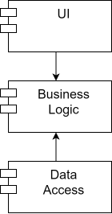

# Проектирование программного обеспечения

## Название проекта
Приложение фитнес-клуба

## Описание идеи проекта
Приложение для клиентов фитнес-клуба. Разрабатываемый программный продукт позволяет клиентам фитнес-клуба записаться на тренировку к тренеру, изучить тренировки и входящие в них упражнения.

## Описание предметной области
Фитнес-клуб – это специализированное учреждение, предоставляющее услуги по занятиям спортом и фитнесом. Для посещения фитнес-клуба часто требуется оформление абонемента. Основными целями такого клуба являются поддержание и улучшение физической формы, повышение выносливости, укрепление мышц и улучшение общего состояния здоровья засчет выполнения тренировок. Во время тренировки вам могут быть предложены различные упражнения с использованием тренажеров, свободных весов, аэробных упражнений, растяжки и других методов. Тренировки обычно проводят тренеры, которые помогают вам подобрать правильные и безопасные упражнения.

## Анализ аналогичных решений
| Название | Выбор тренера | Возможность составления тренером персональной тренировки | Выбор времени | 
|-------------|---|---|---|
| [DDX fitness](https://www.ddxfitness.ru/)    | + | - | + |
| [O2 fitness](https://o2sport.ru/)| - | - | + |
| [World class fitness](https://www.worldclass.ru/) | + | - | + |
| Предлагаемое решение  | + | + | + |

## Обоснование целесообразности и актуальности проекта
Актуальность проекта приложения фитнес-клуба может быть обоснована несколькими факторами:
1. Забота о здоровье. Сегодня все больше людей осознают важность здорового образа жизни и фитнес становится неотъемлемой частью здорового образа жизни.
2. Популярность спорта. Спорт и активные виды отдыха становятся всё более популярными среди молодежи и взрослых. Фитнес клубы предоставляют возможность заниматься спортом и улучшать физическую форму.
3. Тренд на красоту и фитнес. Современное общество ставит эстетические и физические параметры важными. Многие люди хотят выглядеть красиво и стройно, и для этого им нужны услуги фитнес клубов.

## Описание акторов
|Роль|Описание |
|--|--|
|**Гость**|пользователь, который посещает приложение без создания учетной записи или входа в систему. Он может просматривать информацию о клубе, но не может записываться на тренировки или получать доступ к каким-либо персонализированным функциям.|
|**Авторизованный клиент**|пользователь, создавший учетную запись и вошедший в приложение фитнес-клуба. У них есть доступ к дополнительным функциям, таким как запись на тренировку, выбор тренера и управление данными своей учетной записи.|
|**Тренер**|пользователь, который управляет тренировками. У них есть доступ к таким функциям, как создание тренировок, обновление информации о тренировках и обработка записей.|
|**Администратор**|пользователь с повышенными привилегиями, который контролирует общую работу фитнес-клуба. У них есть доступ ко всем функциям и настройкам, включая управление учетными записями пользователей и тренеров.|
   
## Use-Case - диаграмма
 

## ER-диаграмма сущностей
   

## Пользовательские сценарии
1. Сценарий просмотра каталога занятий
   - пользователь заходит в систему;
   - при желении он может либо зарегестироваться, либо авторизоваться;
   - переходит на вкладку "Каталог";
   - просматривает содержимое страницы.
2. Сценарий входа в личный кабинет
   - пользователь заходит в систему;
   - при желании он может либо зарегистрироваться, либо авторизоваться;
   - для регистрации вводятся необходимые данные; для авторизации - логин и пароль;
   - данные проверяются на корректность;
   - в случае успешной проверки, пользователь либо зарегистрирован, либо авторизован.
3. Сценарий выбора тренера
   - пользователь заходит в систему;
   - переходит на вкладку "Тренеры";
   - просматривает содержимое страницы;
   - выбирает подходящего тренера;
   - для записи к тренеру пользователь должен быть авторизован;
   - информация о занятии отображается в добавленных занятиях.
4. Сценарий выбора тренеровки
   - пользователь заходит в систему;
   - переходит на вкладку "Тренировки";
   - просматривает содержимое страницы;
   - выбирает подходящую тренировку;
   - для записи на тренировку пользователь должен быть авторизован;
   - информация о тренировке отображается в добавленных занятиях.

## Формализация ключевых бизнес-процессов

## Тип приложения
Web SPA

## Технологический стек
- Backend: Python
- Frontend: HTML + CSS 
- Database: PostgreSQL
  
## Верхнеуровневое разбиение на компоненты
Приложение будет состоять из 3 компонентов:
- компонент реализации UI
- Компонент реализации бизнес-логики (Business Logic)
- Компонент доступа к данным (Data Access)
  
  
## Диаграмма классов

